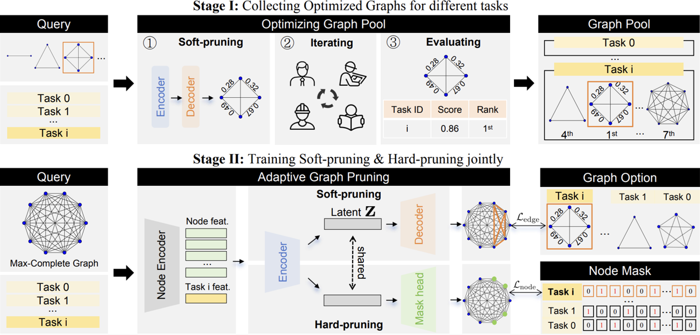
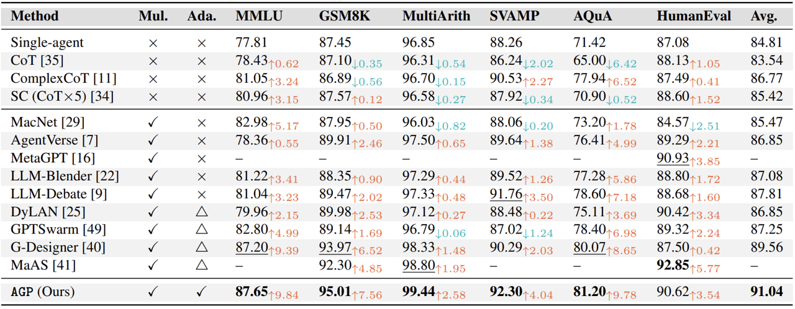
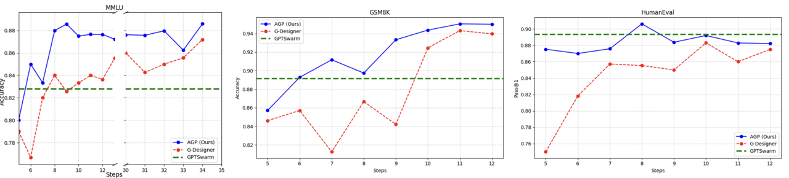
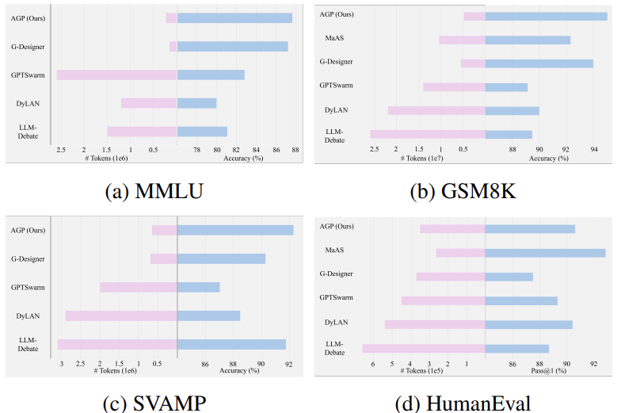

<h1 align='center'>Adaptive Graph Pruning for Multi-Agent Communication</h1>

<div align='center'>
    <strong>Boyi Li</strong></a>
    ·
    <strong>Zhonghan Zhao</strong></a>
    ·
    <strong>Der-Horng Lee</strong></a>
    ·
    <strong>Gaoang Wang</strong></a>
</div>

<div align='center'>Zhejiang University</div>

<br>

<div align='center'>
    <a href='https://arxiv.org/abs/2506.02951'></a>
    <br>
    ECAI 2025 Spotlight
</div>


## Overview 💡

Adaptive Graph Pruning (termed as **AGP**) first mines high-utility sub-graphs from a fixed pool of heterogeneous LLM-agents and preserves their edge labels and node masks as supervision. The next
section sets up notation, casts these ideas in graph-topological terms,
and details the multi-agent communication protocol that AGP learns
to instantiate for any new query.

- Stage I mines near-optimal sub-graphs from a heterogeneous agent pool.
  
- Stage II trains a joint soft–/hard–pruning network that instantiates an adaptive communication topology for any incoming query $\mathcal{Q}$.



Our contribution can be summarized as follows:

- A novel task-adaptive multi-agent collaboration framework, dynamically constructing optimized communication topologies tailored specifically to individual tasks.

- A corresponding two-stage training strategy, jointly optimizing agent quantity (hard-pruning) and communication topology (soft-pruning) for **AGP**.

- Our method delivers state-of-the-art performance while offering excellent inference token economy and high training efficiency.

---

## Quick Start 🚀

We provided the code of the paper. The algorithm implementation code is located in the `AGP` folder, and the experimental code is located in the `experiments` folder.

### Download the Codes

```bash
git clone https://github.com/Resurgamm/AGP.git
cd AGP
```

### Install packages

```bash
conda create -n AGP python=3.10
conda activate AGP
pip install -r requirements.txt
```

### Call API

Add API keys in `AGP/llm/gpt_chat.py`.

```python
MINE_BASE_URL = "" # the BASE_URL of OpenAI LLM backend
MINE_API_KEYS = "" # for OpenAI LLM backend
```

### Stage I

We provide all the datasets (`train_general_reasoning.json`, `train_math_reasoning.json`, `train_coding.json`) from Stage I. You can skip this part.

Or, you can run Stage I on general reasoning by running the following scripts:

```bash
python experiments/general_reasoning_collector.py --mode FullConnected --batch_size 10 --agent_nums 9 --num_iterations 10 --num_rounds 1 --optimized_spatial --resume True
python experiments/get_general_reasoning_dataset.py --mode FullConnected --batch_size 10 --agent_nums 9 --num_iterations 10 --num_rounds 1 --optimized_spatial --resume True
```

And you will get `train_general_reasoning`.

The same applies to running Stage I in the other two fields.

### Stage II

We provide models that have been trained separately in three domains `*.pth`, and you can directly use them for evaluation by modifying the name of any model parameter to `model.pth`.

Or you can run Stage II on general reasoning by running the following scripts:

```bash
python experiments/train_general_reasoning.py --mode FullConnected --batch_size 10 --agent_nums 9 --num_iterations 10 --num_rounds 1 --optimized_spatial --resume True
```

to get the model parameter.

The same applies to running Stage II in the other two fields.

---

## Experiments 📊


**AGP** delivers the strongest overall accuracy.



<p align="center" style="font-size: 18px; color: gray;">
    Table 1: Performance comparison with single-agent approaches, multi-agent topologies, and AGP. The base LLM for all baselines is <i>gpt-4o-mini</i>. We <b>bold</b> the best results and <u>underline</u> the runner-ups. "Mul." and "Ada." indicate multi-agent support and task adaptivity, respectively. ×, △, and ✓denote no, partial, and full support. 
</p>

**AGP** not only attains higher final accuracy but also achieves baseline-beating performance in fewer than ten optimization steps, evidencing markedly better sample- and compute-efficiency during
training.



<p align="center" style="font-size: 18px; color: gray;">
    Figure 2: Under MMLU, GSM8k, and HummanEval benchmarks, the curves of the performance of <b>AGP</b> and G-Designer as the number of training steps increases. Starting from the fifth step, there will be an evaluation after each batch is trained.
</p>


**AGP** can provide more accurate and economical solutions in complex settings without the iterative overhead of full architecture searches.



<p align="center" style="font-size: 18px; color: gray;">
    Figure 3: Visualization of the performance and the number of prompt
    tokens of different multi-agent communication works across MMLU,
    GSM8K, SVAMP, and HumanEval benchmarks
</p>

---

## Citation 📚

If you find **AGP** helpful in your research, please consider citing:

```bibtex
@article{li2025adaptive,
  title={Adaptive Graph Pruning for Multi-Agent Communication},
  author={Li, Boyi and Zhao, Zhonghan and Lee, Der-Horng and Wang, Gaoang},
  journal={arXiv preprint arXiv:2506.02951},
  year={2025}
}
```
